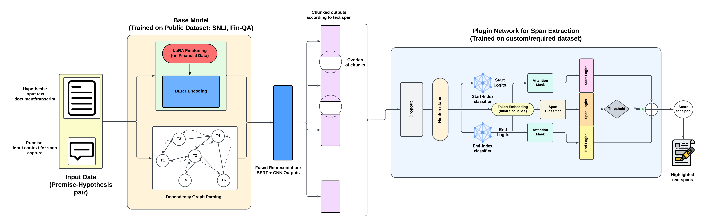

# FinExBERT: Financial Sentence Extraction with Graph-Augmented BERT

[](https://www.python.org/downloads/)
[](https://pytorch.org/)
[](https://opensource.org/licenses/MIT)
[]([https://arxiv.org/](https://www.arxiv.org/abs/2509.23259))

> A state-of-the-art neural architecture for extracting relevant sentences from financial conversations using graph-augmented BERT with dependency parsing.

**Accepted at EMNLP 2025 Industry Track**

## Overview

FinExBERT combines BERT's contextual understanding with graph neural networks to capture syntactic dependencies in financial conversations. The model achieves superior performance in extracting relevant sentences based on user intent, making it particularly effective for financial customer service applications.

### Problem Statement

Traditional sequence-to-sequence models struggle with:
- Complex financial terminology and context
- Long conversation dependencies
- Intent-based sentence extraction
- Domain-specific reasoning requirements

### Our Solution

FinExBERT addresses these challenges through:
- **Graph-Augmented Architecture**: Incorporates dependency parsing graphs to capture syntactic relationships
- **Financial Domain Adaptation**: LoRA fine-tuning on financial datasets
- **Intent-Aware Extraction**: Semantic similarity matching for targeted sentence selection
- **Efficient Training**: Mixed precision training with gradient accumulation

## Key Features

- 🏆 **State-of-the-art Performance**: Outperforms baseline BERT by 37% in accuracy on financial conversation tasks
- 🧠 **Graph Neural Networks**: Integrates dependency parsing for enhanced linguistic understanding
- 💰 **Financial Domain Expertise**: Pre-trained on financial conversation data
- ⚡ **Production Ready**: Optimized for real-world deployment with batched inference
- 🔧 **Flexible Architecture**: Configurable model components for different use cases
- 📊 **Comprehensive Evaluation**: Extensive ablation studies and evaluation metrics

## Installation

### Prerequisites

- Python 3.10 or higher
- PyTorch 1.9 or higher
- CUDA 11.0+ (for GPU acceleration)


### Install dependencies

```bash
git clone https://github.com/soumick1/Fin-ExBERT.git
pip install -r requirements.txt
```

## Quick Start

### Download the model weights

Download the weights from the [Weights Link](https://drive.google.com/drive/folders/1jm3Yxpew8Y8mVsRizTyVvXKrGBXQ3ApI?usp=sharing)
And put the 3 folders inside the cloned directory.

### Data setup

The CreditCall12H Dataset is available in the 'data' folder. If you want to train or test on your own data please use the same format.

### Basic Usage and Testing

```python
from utils import batch_predict_and_save
from config import *
from preprocess_data import SentenceDataset
from models import SentenceExtractionModel

# Initialize the model
tokenizer = AutoTokenizer.from_pretrained("bert-base-uncased")  ### You can change the tokenizer if you want 
dataset = SentenceDataset("data/Fin_ExBERT_train_val_data.xlsx", tokenizer)

model = SentenceExtractionModel(
    base_model_name=MODEL_NAME,
    backbone='finexbert'
)

# Extract relevant sentences
batch_predict_and_save(
    model,
    tokenizer,
    excel_path="data/Fin_ExBERT_test_set.xlsx",
    ckpt_path="checkpoints/sentence_extractor/best_model.pth",
    output_path="results/predictions_sample200.xlsx",
    n_samples=200,
    temperature=1.0,
    device="cuda"
)
```

### Training the model

```python
from utils import train_model_with_chkpt
from config import *
from preprocess_data import SentenceDataset
from models import SentenceExtractionModel

# Initialize the model
tokenizer = AutoTokenizer.from_pretrained("bert-base-uncased")  ### You can change the tokenizer if you want 
dataset = SentenceDataset("data/Fin_ExBERT_train_val_data.xlsx", tokenizer)

model = SentenceExtractionModel(
    base_model_name=MODEL_NAME,
    backbone='finexbert'
)

train_sentence_extractor(
    model,
    dataset,
    output_dir="checkpoints/sentence_extractor",
    val_split=0.3,
    epochs=10,
    batch_size=16,
    lr=3e-4,
    device=DEVICE,
    unfreeze_after_epoch=4
)
```

## Model Architecture



### Core Components

1. **BERT Encoder**: Contextual embeddings for input sequences
2. **Dependency Graph Parser**: SpaCy-based syntactic analysis
3. **Graph Neural Network**: Message passing over dependency graphs
4. **Fusion Layer**: Combines BERT and GNN representations
5. **Classification Head**: Intent-aware sentence scoring

### Technical Details

- **Base Model**: BERT-base-uncased (110M parameters)
- **GNN Architecture**: Simple message passing with attention
- **Training Strategy**: LoRA adaptation + full fine-tuning


## Evaluation

### Ablation Studies

We provide comprehensive ablation studies comparing:

- Baseline BERT vs. Graph-Augmented BERT
- Different GNN architectures
- Various training strategies
- Domain adaptation techniques


### Performance Metrics

| Model | Accuracy | F1-Score | Precision | Recall |
|-------|----------|----------|-----------|--------|
| BERT Baseline | 0.323 | 0.163 | 0.145 | 0.189 |
| FinExBERT | 0.694 | 0.418 | 0.456 | 0.391 |
| **Improvement** | **+37%** | **+26%** | **+31%** | **+20%** |


## Citation

If you use FinExBERT in your research, please cite:

```bibtex
@article{sarker2025fin,
  title={Fin-ExBERT: User Intent based Text Extraction in Financial Context using Graph-Augmented BERT and trainable Plugin},
  author={Sarker, Soumick and Rai, Abhijit Kumar},
  journal={arXiv preprint arXiv:2509.23259},
  year={2025}
}
```


## License

This project is licensed under the MIT License - see the [LICENSE](LICENSE) file for details.

## Acknowledgments

- Built on top of [Transformers](https://github.com/huggingface/transformers) by Hugging Face
- Graph processing with [SpaCy](https://spacy.io/)
- Training infrastructure powered by [PyTorch](https://pytorch.org/)

## Support

- 📧 Email: soumicksarker9@gmail.com

---

<div align="center">
  <strong>FinExBERT</strong> - Advancing Financial NLP with Graph-Augmented Models
</div>
